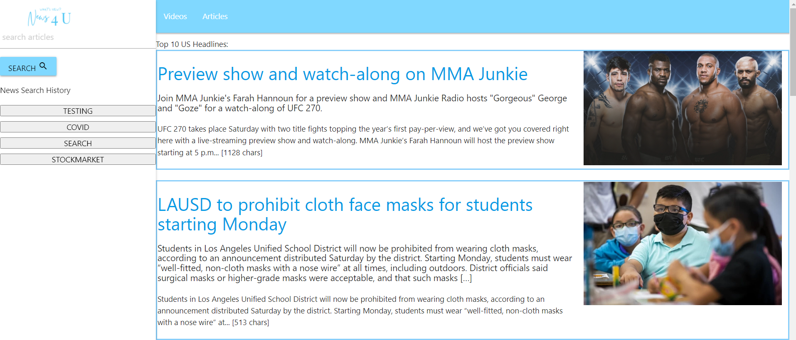
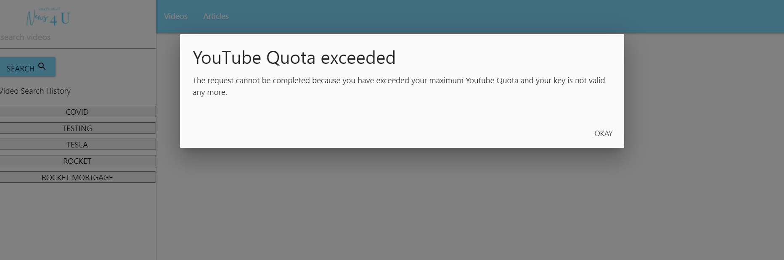
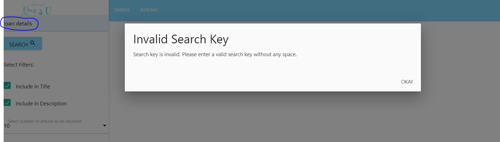

# News 4 U

## Pupose
Build news website to display news headlines, display articles and videos based on user input.

## User Story
As a reader,
I should be able to search using most important topics/discusson of my interests,
so that I can keep up with the current events

## Site Details
- As soon as user launches website then :
    - User will see top navidation with 2 links videos and Articles
    - User will see side navigation on left to search news by keyword
    - In middle of screen user will see subtitle as "TOP 10 US Headlines"
    - User will see top 10 US headlines in English
- When user search for specific articles then :
    - Subtitle will be replaced based on user input
    - Top 10 US headlines will be removed
    - User will see top 10 news based on search input
    - User should be able to see following filters
        - Select number of articles to be displayed. Options are 10, 20, 30, 40, 50. Default and selected is 10
- When user selects number of articles then based on selection number of articles should be displayed in main screen
- By default search keyword is used in articles description and title and user has choice to select option to search keyword either in title or description. 
- User will see search history which is saved in local storage
- When User click on video on top of navigation
    - Default news videos will be displayed
    - User can search for videos
    - User can change how many results should be displayed
- Clicking on article will land on to main page

#### Technologies Used
- API's Used:
    - https://gnews.io/
    - https://youtube.googleapis.com/youtube/v3/
- Languages:
    - HTML
    - CSS
    - Java Script
- Network Storage API

#### Current Limitation/Future Enhanceent:
User can search only using keywords without spaces.

# Application Details:
Please access application here:

https://rpkrupali1.github.io/News4U/

Deployed Application:

When api key is exceeded user will get an error modal as below:

When user enters invalid key then an error displayed as below:
